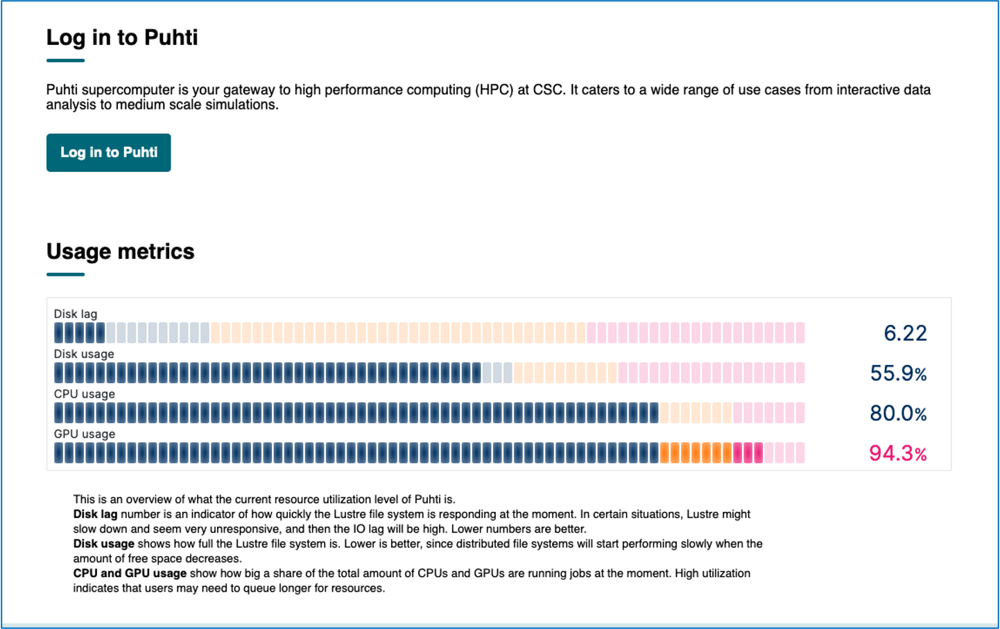

#  Cytodata hackathon 2023 (WIP)

  Compute environemnt provided at CSC supercomputer will be used for this hackathon.  
  
# Brief description on using computing environment on Puhti
  - *Module system*: CSC uses module system to manage application stack in supercomouting environment. Applications installed as modules can be easily accessed for ready use in both interactive and batch jobs. Detailed instructions about using modularised applications can be found in [CSC documentation pages](https://docs.csc.fi/computing/modules/)
  - *Disk areas*: CSC supercomputers have three main disk areas namely home, projappl and scratch and visible to all compute and login nodes.  Each disk area has itw own use and come with specific quota on the size as well as number of files one can keep. Default quotas and their specific uase can found in [CSC documentation](https://docs.csc.fi/computing/disk/)
  - *Custom installations*: It is possible to install own software on CSC supercomputers if you cannot find a software suitable for your needs from the list of [pre-installed applications](https://docs.csc.fi/apps/) or using module spider. Typically, one downloads the source code of the software, compiles the code, and installs to a location where the user has write-access, e.g. the project's /projappl director. More about installation on [CSC docs page](https://docs.csc.fi/computing/compiling-puhti/)
  - *Puhti web interface*: One can use web interface for [Puhti](www.puhti.csc.fi) to access the supercomputer via a web browser. Mire information can be found on web interfaces on [CSC docs page](https://docs.csc.fi/computing/webinterface/)

## Preparing custom notebooks for cytodata hackathon 2023

A custom Jupyter notebook for cytodata hackathon 2023 can be provisioned through [Puhti web interface](https://www.puhti.csc.fi). The customisation of notebook involves the following steps:

- [Installing necessary python packages to *projappl* directory using *tykky* wrapper tool](#installing-necessary-python-packages-to-projappl-directory-using-tykky)
- [Creating a course environment/module(s)](#creating-a-course-environment-modules)
- [Accessing notebook *via* Puhti web interface](#accessing-notebook-via-puhti-web-interface)
- [Installing custom Rstudio packages](#installing-custom-rstudio-packages)
- [Useful CSC documentation](useful-CSC-documentation)

### Installing necessary python packages to *projappl* directory using *tykky*:

Tykky wraps installations inside singularity container for improved performance metrics including faster startup times, reduced IO load, and  fewer number of files on large parallel filesystems. Please refer to CSC documentation on [tykky](https://docs.csc.fi/computing/containers/tykky/) for more detailed information.

For the installation of computational environment required for cytodata hackathon 2023, we use the tykky in the following way (make sure to edit with correct CSC project name as needed):

```bash
# start interactive session once you are in login node
sinteractive -c 8 -m 50000 -d 100
# load needed packages
module load git
module load purge
module load tykky
# install python libraries using tykky wrapper tool
mkdir -p /projappl/<project>/$USER && mkdir -p /projappl/<project>/$USER/CytoHackathon
conda-containerize new --prefix  /projappl/<project>/$USER/CytoHackathon Cytohackathon_py310.yml     # install basic packages
export PATH="/projappl/<project>/$USER/CytoHackathon/bin:$PATH"
conda-containerize update /projappl/<project>/$USER/CytoHackathon/  --post-install requirements_Cytohackathon.sh   # update package list 

```
Tykky would install all needed packages (as listed in the file, yaml) to the directory '/projappl/project_xxxx/CytoHackathon'


### Creating a course environment modules

The files for course environments (modules) can be created in the directory /projappl/project_xxxx/www_puhti_modules/. The www_puhti_modules directory can be created if it does not exist.

The two files needed for setting up the course modules are:
   - a <<module_name>>.lua file that defines the module that sets up the Python environment. Only files containing the text Jupyter will be visible in the app.
   - a <<module_name>>-resources.yml that defines the default resources used for Jupyter.
  
For this CytoHackathon event, the above mentioned two files (i.e., .lua and .yaml files) are created  in the git repository we cloned above. so just copy them over to appropriate place in projappl folder and edit the correct project for this course as below:

```bash

mkdir -p /projappl/project_xxxx/www_puhti_modules && cp CytoHackathon-resources.yml	CytoHackathon.lua /projappl/project_xxxx/www_puhti_modules

# Edit the correct project number (in two places in CytoHackathon-course.lua file) in the the copied files in /projappl/project_xxxx/www_puhti_modules.

```

## Installing Custom Rstudio packages

The RStudio application installed on Puhti comes with large set of pre-installed R packages and available *r-env* versions can be found on [CSC doccumentation pages](https://docs.csc.fi/apps/r-env/).  Please refer to CSC documentation on how to use R in batch and interatcive job applications. Installation of custom R packages can be found [here](#https://docs.csc.fi/apps/r-env/#r-package-installations)

Briefly: R/Rstuido is installed as containers and users can only install the missing R packages in a dedicated writable disk spaces (
e.g., /projappl). When installing R packages, point R to the writable disk space. 

Here is an example on how to  install a R package:
```
sinteractive -c 4     # Once login to Puhti, start interactive node with four cores, you can also specify memory (-m 50000) and disk space  (-d 100)
module load r-nev/430   # you can for example load R v430 version
# Add this to your R code:
.libPaths(c("/projappl/<project>/project_rpackages_<rversion>", .libPaths()))
libpath <- .libPaths()[1]

# This command can be used to check that the folder is now visible:
.libPaths() # It should be first on the list

# Package installations should now be directed to the project
install.packages("package", lib = libpath)
BiocManager::install("mistyR") # this will install "mistyR" package using a R package manager
install.packages("https://cran.rstudio.com/src/contrib/scattermore_1.2.tar.gz", repos=NULL, type="source") # install a pckage from source
remotes::install_github("satijalab/seurat", "seurat5", quiet = TRUE)  # install package from a Github
```
Please note that you have to run the following command every time you launch R session if you want to use your custom installations.

```
.libPaths(c("/projappl/<project>/project_rpackages_<rversion>", .libPaths()))
```

### Accessing notebook via Puhti web interface

1. Login to [Puhti web interface](https://www.puhti.csc.fi/public/login.html)
2. Login with CSC or course credentials (Users should have accepted Puhti service in [myCSC](https://my.csc.fi/welcome) page under a course ( or own) project before using this service). Login page is as shown below:



3. Once login is successfull, select "Interactive Sessions" on the top menu bar and then click "Jupyter for courses". On the right hand side you can see the different fields for selection before launching a job.  For this course, select the "Project" and "Working directory corresponding"  to course project. Then you will be able to see "CytoHackathon" module under the "Course module" field. You can then launch Jupyter notebook whick will be launched in the interaction partition by default. You can also change the default settings by checking "Show custom resource settings".

4. Upon successful launching a job, you can click on "connect to Jupyter" to see the course notebook corresponidng to CytoHackathon.


###  Useful CSC documentation

- [Jupyter for course](https://docs.csc.fi/computing/webinterface/jupyter-for-courses/)
- [Tykky containerisation](https://docs.csc.fi/computing/containers/tykky/)


